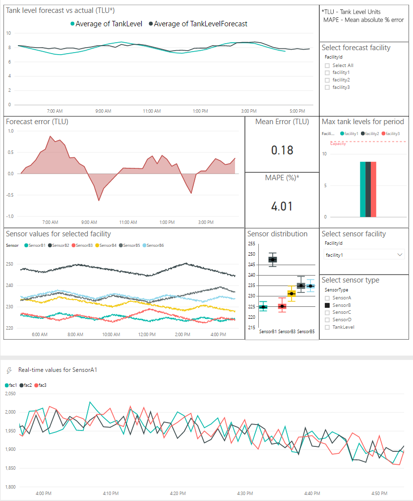
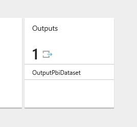
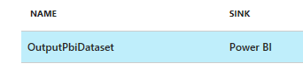
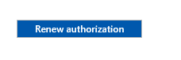
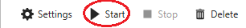

# [Oil & Gas Tank Level Forecasting Solution](https://go.microsoft.com/fwlink/?linkid=831187)

This document is focusing on the post deployment instructions for the automated deployment through [Cortana Intelligence Solutions](https://gallery.cortanaintelligence.com/solutions). The source code of the solution as well as manual deployment instructions can be found [here](../Manual%20Deployment%20Guide).

# Architecture

The architecture diagram shows various Azure services that are deployed by the Oil & Gas Tank Level Forecasting Solution using [Cortana Intelligence Solutions](https://gallery.cortanaintelligence.com/solutions), and how they are connected to each other in the end to end solution.

1.	The data feeds into the **Azure Event Hubs** and **Azure SQL** service as data points or events, that will be used in the rest of the solution flow.

3.	**Azure Stream Analytics** analyze the data to provide near real-time analytics on the input stream from the event hub and directly publish to Power BI for visualization.

4.	The **Azure Machine Learning** service is used to make forecast on the tank level of particular region given the inputs received.

5.	**Azure SQL Data Warehouse** is used to store the prediction results received from the **Azure Machine Learning** service. These results are then consumed in the **Power BI** dashboard.

6. **Azure Data Factory** handles orchestration, and scheduling of the hourly model retraining.

7.	Finally, **Power BI** is used for results visualization, so that users can monitor the tank level from a facility in real time and use the forecast level to prevent spillage.

All the resources listed above besides Power BI are already deployed in your subscription. The following instructions will guide you on how to monitor things that you have deployed and create visualizations in Power BI.

# Post Deployment Instructions

Once the solution is deployed to the subscription, you can see the services deployed by clicking the resource group name on the final deployment screen in the CIS.

This will show all the resources under this resource groups on [Azure management portal](https://portal.azure.com/).

After successful deployment, the entire solution is automatically started on cloud. You can monitor the progress from the following resources.

## **Monitor progress**

### Azure Application Service

Six Azure Application services are created during the deployment. You can monitor them by clicking the link on your deployment page.
- One-time running web jobs are used to start certain Azure services.
  - TankWjCopyMl: Copies the ML experiment from gallery to the newly created ML workspace and publish it as ML WebService.
  - TankWjDataFactory: Starts the Azure Data Factory pipelines.
  - TankWjPrepareSQL: Creates required tables in the SQL database
  - TankWjPreseedSQL: Copies the historical tank level data to Azure SQL.
  - TankWJStartStream: Starts Azure Stream Analytics.
- Continuous running web jobs are used as data generator.
  - TankGenerator: Simulates tank level data and sends it to Event Hub every minute.

### Azure Event Hub

The Azure Event Hub is used to ingest the data from the data generator.

### Azure Stream Analytics

Two Azure Stream Analytics jobs were created:
- The first is used to process the data from event hub and redirects it to the SQL Data Warehouse.
- The second also processes the data from event hub but redirects it to Power BI. You can use this second stream when creating a real-time Power BI dashboard. (See below.)

### Azure Machine Learning Studio Workspace

The Azure Machine Learning Studio workspace contains the predictive experiment used to create a forecasting Azure Web Service. When Azure Stream Analytics  obtains a set of data points from Event Hub, it passes them to the web service and obtains a forecast. You can view your forecasting model used by the predictive experiment by navigating to your workspace by clicking the link on your deployment page.

### Azure Storage

The Azure Storage account is used by Azure Machine Learning Studio to hold training data, test execution of the machine learning model, and the trained models themselves.

### Azure SQL Server/SQL Data Warehouse

Azure SQL data warehouse is used to save the Event Hub data and the forecast results. You can use the SQL server and database names shown on the deployment page with the username and password that you set up in the beginning of your deployment to log in your database and look at the results.

### Azure Data Factory

Azure Data Factory is used to orchestrate data movement and forecasting activities. You can monitor the data pipelines by clicking the link on your deployment page. Note that the application services need time to all complete their initial runs. Until then, it is normal to see errors in your Azure Data Factory pipelines.

## **Visualization**

Power BI dashboard can be used to visualize the real-time tank level data as well as the updated tank level forecast results. The following instructions will guide you to build a dashboard to visualize data from database and from real-time data stream.

### Visualize Tank Level Data from Data Warehouse

The essential goal of this part is to get the tank level forecast of each region and visualize it. Power BI can directly connect to an Azure SQL data warehouse as its data source, where the prediction results are stored.

> Notes:
> 1) In this step, the prerequisite is to download and install the free software [Power BI desktop](https://powerbi.microsoft.com/desktop).
> 2) We recommend you initiate this process as soon as the solution has deployed, as it will take 2-3 hours to gather enough data points to visualize.

A single Power BI dashboard can be configured to display:
- the forecast output from the Azure Machine Learning web service stored in the SQL Data Warehouse,
- the tank sensor data stored in the SQL Data Warehouse, used as input to the machine learning model, and
- the live streaming output of tank sensor data flowing from Azure Stream Analytics.

1. Get the names of the resources from the deployment page.
    - The SQL server and database names.
      - The server username and password will be the ones you chose during deployment. You may reset the password from the SQL Server's page on [Azure management portal](https://portal.azure.com/).
    - The Azure Stream Analytics Power BI job name.

2. Start the Azure Stream Analytics Power BI job.
    - In the deployment page, click on the link for the Azure Stream Analytics Power BI job. This should take you to the Azure Management Portal page for the job.
    - In the blade on the right, click on the ***Outputs*** tile. 
      
    - In the blade that opens, click on the ***OutputPbiDataset*** line. 
      
    - In the blade that opens, click on the ***Renew Authorization*** button. 
       
      You may be asked to sign in. Afterward, wait for the message saying you had a "Successful connection test."
    - Close the blade to return to the ***Overview*** blade, and then click the ***Start*** control. 
      
    - In the blade that opens, at the bottom of the blade, click the ***Start*** button.

   You should soon see a message saying "Streaming job started successfully." It will take 2-3 hours for enough data to accumulate for a good display.

3. Visualizing the Azure Stream Analytics output.
    - Log in to [Power BI](https://powerbi.microsoft.com/).
    - In the pane on the left hand side, under ***Workspaces***, select your workspace.
    - Click on the ***Datasets*** tab.
    - Check that the dataset **tankpredrawagg** has appeared.
    - Click on the ***Dashboards*** tab.
    - Click on ***+ Create*** in the upper-right corner.
    - Select ***Dashboard*** to create a new dashboard, and call it *TankLevelForecast*.
    - Click on ***+ Add tile*** in the dashboard's toolbar.
    - Choose ***Custom Streaming Data*** and click ***Next***.
    - Choose the **tankpredrawagg** dataset from the list, and click ***Next***.
    - Under *Visualization Type* select *Line chart* from the drop down menu.
    - Under *Axis* click ***+ Add value*** and choose *time* from the drop down menu.
    - Under *Values* click ***+ Add value*** click *fac1*.
      - Repeat this step for *fac2* and *fac3*.
    - Under *Time window to display* select the last 60 minutes.
    - Click ***Next***.
    - Enter the chart title *Real-time values for SensorA1*.
    - Click ***Apply***.

4. Visualizing the forecast output and sensor values.
    - Download and open the TankLevelForecast.pbix report file.
      - The report visuals will display errors until the connection is made to the SQL Data Warehouse.
    - Click ***Get Data***.
    - Select **Azure**, choose ***Azure SQL Data Warehouse*** and click ***Connect***.
    - Enter the server name and database name of the SQL Data Warehouse you collected at step 1.
    - Choose DirectQuery and click ***OK***.
      - If a SQL Server Database credentials window pops up, select the ***Database*** tab and enter the server username and password you chose during deployment.
      - Click ***Connect***.
    - When the *Navigator* page appears, select check the boxes next to the *TankLevelForecastPbi* and *TankLevelSensorPbi* views.
    - Click ***Load***.
    - The visuals should eventually appear in the report.
    - Publish this report to Power BI Service by clicking the ***Publish*** button at the top of the page.
    - Select your Power BI workspace and click ***Select***.
    - A message will appear requesting that you enter credentials for the data source.
        - Click ***Open 'TankLevelForecast.pbix' in Power BI*** which will open your published report in Power BI service.
        - Click ***Enter credentials*** in the message that appears above the report.
        - Click ***Enter credentials***.
        - Enter your database's credentials and click ***Sign In***.
    - The *TankLevelForecast* report will now be available under **Reports** in your workspace.

4. Creating a single dashboard.

    - Click on the ***TankLevelForecast*** report to open it.
    - Click the ***Pin Live Page***.
    - Select **Existing Dashboard** and choose the *TankLevelForecast* dashboard you created earlier to display the Azure Stream Analytics job output.
    - Click ***Pin live***.
    - Go to the *TankLevelForecasting* dashboard.
    - Resize and rearrange the tiles until you are happy with the dashboard's appearance.

## **Customization**

You can reuse the source code in the [Manual Deployment Guide](../Manual%20Deployment%20Guide) to customize the solution for your data and business needs.
