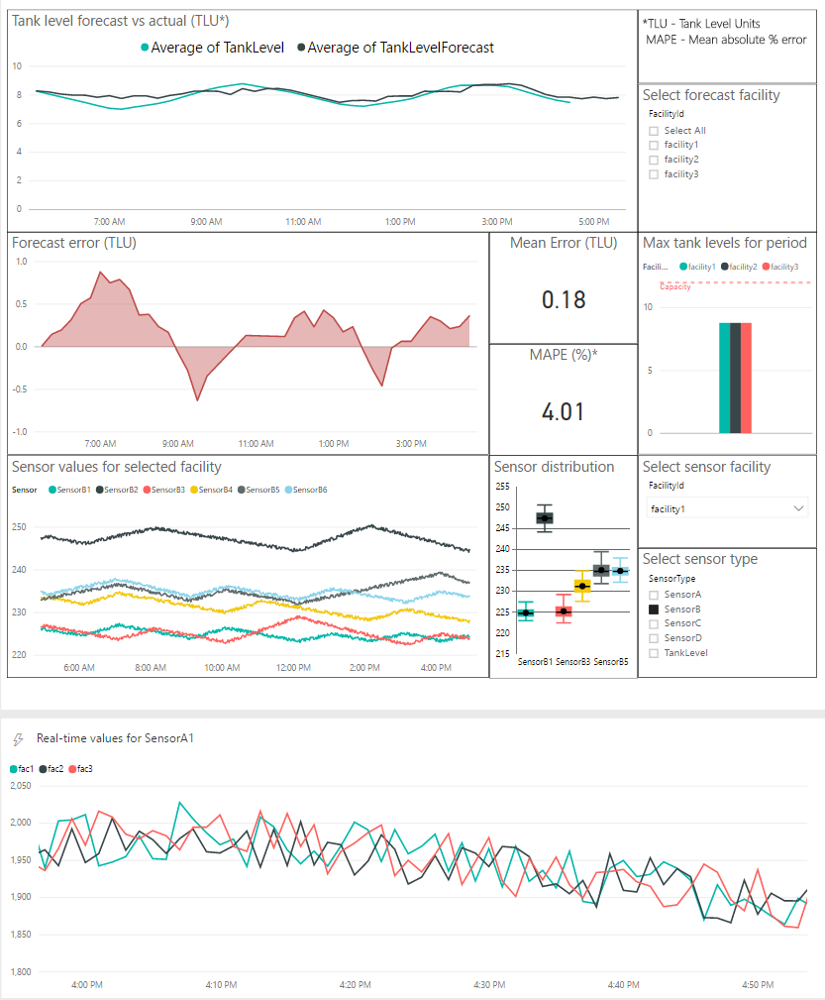

# Cortana Intelligence Suite: Oil & Gas Tank Level Prediction Solution  

# 1. Introduction

Today, most facilities operate reactively to problems in tank levels. This often leads to spills, emergency shutdowns, expensive remediation costs, regulatory issues, costly repairs and fines. Tank level forecasting allows facilities to manage and abate these and other problems. The tank level forecasting process starts at the well input. The oil, water, and gas mixture is measured as it comes into the facility via meters, is separated into its components, and the oil is sent to tanks. Levels are monitored and recorded in tanks during the refining process and then oil, gas, and water output are recorded via sensors, meters, and records. Forecasts are then made using data from the facility, every 15 minutes for example.

For a more detailed description, please see the [solution description](SolutionDescription.md).

# 2. Solution Architecture

 - Event ingestion is performed using an [Azure Event Hub](https://azure.microsoft.com/en-us/documentation/articles/event-hubs-overview/) to which records are sent using a simulated data generator.
 - Events are passed, via a [Azure Stream Analytics](https://azure.microsoft.com/en-us/services/stream-analytics/) job to an instance of [Azure SQL Data Warehouse](https://azure.microsoft.com/en-us/services/sql-data-warehouse/)
 - An [Azure Data Factory](https://azure.microsoft.com/en-us/services/data-factory/) triggers an  [Azure Machine Learning](https://azure.microsoft.com/en-us/services/machine-learning/) endpoint every 15 minutes and the results are passed back to the Azure SQL Data Warehouse
 - Results showing ingestion and predictions are then viewable through [Power BI](https://powerbi.microsoft.com/)  
 

This tutorial will guide you through the process creating, from the ground up, the tank prediction solution.

# 3. Creating A Tank Predictive Solution

## Prerequisites

This tutorial will require:

 - An Azure subscription, which will be used to deploy the  project
   (a [one-month free
   trial](https://azure.microsoft.com/en-us/pricing/free-trial/) is
   available for new users)
 - An [Azure Machine Learning Studio](https://studio.azureml.net/) account.
 - A Windows Desktop or a Windows based [Azure Virtual Machine](https://azure.microsoft.com/en-us/services/virtual-machines/) to run a data generation tool.
 - Visual Studio or other SQL tool of choice to log into the SQL Server to create tables.    

## Manual Steps
This section will walk you through the steps to manually create the solution in your Azure subscription.

***NOTE*** Some resources require unique names. Record your naming choices if they differ from the options given in this document.

## Create an Azure Resource Group for the solution
An [Azure Resource Group](https://azure.microsoft.com/en-us/documentation/articles/resource-group-overview/) provides a logical way to group and manage a number of resources.  

 - Log into the [Azure Portal](https://ms.portal.azure.com)
 - At the top of the page click __+New__
 - Enter in a name for the resource group and choose your subscription.
 - For *Resource Group Location* you should choose one of the following as they are the locations that support machine learning workspaces:
    - South Central US
    - West Europe
    - Southeast Asia  

## Create an Azure Event Hub
The Azure Event Hub is the target for all incoming sensor readings. In an actual deployment this would be the target of any gateways that are collecting sensor information from individual wells.

Although not shown in this demonstration, Azure Data Factory could also pull the messages directly from an on-prem or Azure SQL instance.

 - Log into the [Azure Portal](https://ms.portal.azure.com)
 - In the left hand menu select *Resource groups*
 - Locate the resource group  you created for this project and click on it to display the resources associated with the group in the resource group blade.
 - At the top of the Resource Group blade click __+Add__.
 - In the *Search Everything* search box enter **Event Hubs**
 - Choose ***Event Hubs*** from the results, then click *Create*
 - For the name, use ***tankpredictionehns*** and ensure the subscription, resource group, and location match the selections made previously, then click *Create*.
 - Return back to *Resource groups* and choose the resource group for this solution.
 - Click on ***tankpredictionehns***, then on the subsequent blade, choose __+ Event Hub__
 - Enter ***tankpredictioneh*** as the name, move partition count to 4 and click *Create*

## Create an Azure SQL Data Warehouse and Server
The Azure SQL Data Warehouse is used as a target for incoming sensor readings from the event hub. The Azure Machine Learning experiment will read and write directly to this database during processing.

 - Log into the [Azure Portal](https://ms.portal.azure.com)
 - In the left hand menu select *Resource groups*
 - Locate the resource group  you created for this project and click on it to display the resources associated with the group in the resource group blade.
 - At the top of the Resource Group blade click __+Add__.
 - In the *Search Everything* search box enter **SQL Data Warehouse**
 - Choose ***SQL Data Warehouse*** from the results, then click *Create*
 - Enter ***tankprediction*** as the database name
 - Ensure the subscription and resource group match previous selections.
 - For *Select source* leave the selection as *Blank database*
 - For server, click create new.
 - Give the server a unique name, valid user name and valid password.
 - Under Collation choose the default setting *SQL_Latin1_General_CP1_CI_AS*.
 - Under *Performance* we recommend starting with 400 DWUs. You can adjust the performance of your data warehouse after creation.
 - Click *Create* and return to the *Resource groups* blade.
 - When the server has been created, click on the SQL server in the list of resources.
 - On the *SQL Server* blade, choose ***Firewall*** and create a rule named **Open**
    - Start IP: 0.0.0.0, End IP: 255.255.255.255
    - Click ***Save***

## Create Azure SQL Tables
For processing in the pipelines two tables need to be created in the SQL Data Warehouse. Using your SQL tool of choice, run the following two scripts against the server. For convenience, click "Open in Visual Studio" icon on the Overview page of the data warehouse you just created to access the data warehouse.

### Sensor Table
```
CREATE TABLE [dbo].[TankLevelSensor](
    Time [datetime2] NOT NULL,
    FacilityId varchar(50) NOT NULL,
    Sensor varchar(50) NULL,
    Value float NULL
)

CREATE NONCLUSTERED INDEX [IX_TankLevelSensor_Column]
    ON [dbo].[TankLevelSensor]([Time] ASC, [FacilityId] ASC, [Sensor] ASC);
```
### ML Result Table
```
CREATE TABLE [dbo].[TankLevelForecast](
    Time [datetime2] NOT NULL,
    FacilityId varchar(50) NOT NULL,
    TankLevel float NULL,
    TankLevelForecast float NULL
)

CREATE NONCLUSTERED INDEX [IX_TankLevelForecast_Column]
    ON [dbo].[TankLevelForecast]([Time] ASC, [FacilityId] ASC, [TankLevel] ASC);
```
## Create Azure SQL Views for Power BI
Two database views are required to display the forecast output and sensor values in Power BI. Using your SQL tool of choice, run the following two scripts against the server.

### Sensor View
```
CREATE VIEW [dbo].[TankLevelSensorPbi] as (
    SELECT [Time]
        , [FacilityId]
        , [Sensor]
        , [Value]
        , CASE
            WHEN LEFT([Sensor], 9) = 'TankLevel' THEN 'TankLevel'
            ELSE LEFT([Sensor], 7)
        END as [SensorType]
    FROM [dbo].[TankLevelSensor]
    WHERE [Time] > (SELECT DATEADD(hour, -12, max([Time])) FROM [dbo].[TankLevelSensor])
)
```

### Forecast View

```
CREATE VIEW [dbo].[TankLevelForecastPbi] as (
    SELECT Forecasts.[Time]
        , Forecasts.[FacilityId]
        , Actuals.[TankLevel]
        , Forecasts.[TankLevelForecast]
        , Forecasts.[TankLevelForecast] - Actuals.[TankLevel] as Error
        , (ABS(Forecasts.[TankLevelForecast] - Actuals.[TankLevel]) / Actuals.[TankLevel]) * 100 as AbsPctError
    FROM (
        SELECT DATEADD(hour, 1, DATEADD(minute, ROUND(DATEDIFF(minute, 0, [Time]) / 15.0, 0) * 15, 0)) as [Time]
                , [FacilityId]
                , [TankLevelForecast]
                FROM [dbo].[TankLevelForecast]
    ) as Forecasts
    LEFT JOIN (
        SELECT DATEADD(minute, ROUND(DATEDIFF(minute, 0, [Time]) / 15.0, 0) * 15, 0) as [Time]
                , [FacilityId]
                , [TankLevel]
                FROM [dbo].[TankLevelForecast]
    ) as Actuals
    ON Actuals.[Time] = Forecasts.[Time]
    AND Actuals.[FacilityId] = Forecasts.[FacilityId]
    WHERE Forecasts.[Time] > (SELECT DATEADD(hour, -12, max([Time])) FROM [dbo].[TankLevelForecast])
)
```

## Create Stream Analytics Jobs
This solution contains two Azure Stream Analytics jobs. The first will move data from the Azure Event Hub to the SQL Data Warehouse. The other pushes a live stream of sensor data to Power BI.

### SQL Data Warehouse job

 - Log into the [Azure Portal](https://ms.portal.azure.com)
 - In the left hand menu select *Resource groups*
 - Locate the resource group  you created for this project and click on it to display the resources associated with the group in the resource group blade.
 - At the top of the Resource Group blade click __+Add__.
 - In the *Search Everything* search box enter ***Stream Analytics job***
 - Choose ***Stream Analytics job*** from the results then click *Create*
 - Enter ***tankpredictionsa*** as the name and choose the subscription, resource group and location using previous choices.
 - Click *Create* and return to the *Resource groups* blade.
 - Click on the ***tankpredictionsa*** job to open the Azure Stream Analytics job blade.
 - Under *Job Topology* click ***Inputs***
   - Click ***+Add***
        - **Input alias** : InputHub
        - **Source Type** : Data stream
        - **Source** : Event hub
        - **Subscription** : Use event hub from current subscription. If that causes error in the subsequent step(s), use "Provide event hub settings manually" instead.
        - **Service bus namespace** : tankpredictionehns
        - **Event hub name** : tankpredictioneh
        - **Event hub policy name** : RootManageSharedAccessKey
        - **Event hub consumer group** : Leave blank
        - **Event serialization format** : CSV
        - **Delimiter** : comma(,)
        - **Encoding** : UTF-8
        - Click ***Create***
 - Under *Job Topology* click ***Outputs***
    - Click ***+Add***
        - **Output alias** : OutputTable
        - **Sink** : SQL Database
        - **Subscription** : Use SQL database from current subscription. If that causes error in the subsequent step(s), use "Provide SQL database settings manually" instead.
        - **Database** : *(The database server you created)*
        - **Username** : *(The user name  you created)*
        - **Password** : *(The user password you created)*
        - **Table** : TankLevelSensor (created earlier with the SQL script)
        - Click ***Create***
  - Under *Job Topology* click ***Query***
    - Copy the following query into the query box.

      ```
      SELECT EventProcessedUtcTime as time,
            facilityid,
            sensor,
            value
      INTO OutputTable
      FROM InputHub
      ```

    - Click ***Save***
  - When the input, output and query have been configured, return to the Stream Analytics job blade and click ***Start***
    - The **Start job** blade will appear
    - Select Now as the **Job output start time** and then click **Start** at the bottom of the blade.

### Power BI job

- In the [Azure Portal](https://ms.portal.azure.com), using the same resource group and subscription as above, create a new Azure Stream Analytics job called ***tankpredictionsapbi***.
- Click on the ***tankpredictionsapbi*** job to open the Azure Stream Analytics job blade.
- Under *Job Topology* click ***Inputs*** and then ***+Add***
    - add the InputHub as with the SQL Database job above
- Under *Job Topology* click ***Outputs*** and then ***+Add***
    - **Output alias** : OutputPbiDataset
    - **Sink** : Power BI
    - Under **Authorize Connection** click ***Authorize***
    - Enter the credentials of your Power BI account and further fields will appear
    - **Group Workspace** : pick the Power BI workspace you want your dataset to be available in
    - **Dataset Name** : TankPredictions
    - **Table Name** : TankPredictions
- Under *Job Topology* click ***Query*** and then ***+Add***
    - Copy the following query into the query box

      ```
      WITH faq1 AS (
	      SELECT min(EventProcessedUtcTime) AS time , avg(value) AS fac1
	      FROM InputHub TIMESTAMP BY EventProcessedUtcTime
	      WHERE facilityid='facility1' AND sensor='SensorA1'
	      GROUP BY TumblingWindow(minute,1)
	  ),
      faq2 AS (
	      SELECT min(EventProcessedUtcTime) AS time , avg(value) AS fac2
	      FROM InputHub TIMESTAMP BY EventProcessedUtcTime
	      WHERE facilityid='facility2' AND sensor='SensorA1'
	      GROUP BY TumblingWindow(minute,1)
	  ),
      faq3 AS (
	      SELECT min(EventProcessedUtcTime) AS time , avg(value) AS fac3
	      FROM InputHub TIMESTAMP BY EventProcessedUtcTime
	      WHERE facilityid='facility3' AND sensor='SensorA1'
	      GROUP BY TumblingWindow(minute,1)
	  )
      SELECT f1.time
	      , f1.fac1
	      , f2.fac2
	      , f3.fac3
      INTO OutputPbiDataset
      FROM faq1 f1
      JOIN faq2 f2
      ON DATEDIFF(second, f2, f1) BETWEEN -5 AND 5
      JOIN faq3 f3
      ON DATEDIFF(second, f3, f1) BETWEEN -5 AND 5
      ```

    - Click ***Save***
- When the input, output and query have been configured, return to the Stream Analytics job blade and click ***Start***
    - The **Start job** blade will appear
    - Select Now as the **Job output start time** and then click **Start** at the bottom of the blade.

## Create Machine Learning Workspace
To create an Azure Machine Learning experiment, you must first have a Machine Learning Workspace to hold your machine learning experiments.

 - Log into the [Azure Portal](https://ms.portal.azure.com)
 - In the left hand menu select *Resource groups*
 - Locate the resource group  you created for this project and click on it to display the resources associated with the group in the resource group blade.
 - At the top of the Resource Group blade click __+Add__.
 - In the *Search Everything* search box enter **Machine Learning Workspace**
 - Choose ***Machine Learning Workspace*** from the results, then click *Create*
 - Enter ***tankpredictionmlws*** as the name
 - Ensure the subscription, resource group and location match previous selections.
 - Leave both storage account and web service plan as *Create new* and provide names acceptable to the user interface.
    - You will need the name of this storage account later when setting up the Azure Data Factory.
 - Click *Web service plan pricing tier* and choose ***S1 Standard***
 - Click *Create* and return to the *Resource groups* blade.

## Copy Machine Learning Experiments From Gallery
Now that we have a machine learning workspace, we can copy the experiment into that workspace in order to publish it as a web service.

 - Go to the gallery by following [this](http://gallery.cortanaintelligence.com/Experiment/Tank-Level-Forecasting-Predictive-Exp-2) link.
 - Once loaded, click the ***Open in Studio*** button
    - When necessary, log in to your Machine Learning Studio account
 - Select the region that matches previous selections and choose the workspace ***tankpredictionmlws***, then click *OK*
 - When the experiment has been copied into your workspace, click on the *Experiments* tab and choose ***Tank Level Forecasting [Predictive Exp.]***
 - When the experiment opens, click on the ***Import Data*** node and under the settings that appear, enter in the SQL information from the previous steps. (There is no need to modify the query at this time.) Then, do the same for the ***Export Data*** node.  
 - At the bottom of the page click ***Run***
 - When completed, click ***Deploy Web Service*** using the selection ***Deploy Web Service [Classic]***
 - Once deployed, navigate to ***WEB SERVICES*** and click on **Tank Level Forecasting** and record the following information that will be needed at the next step.
    - Record the *API key*
    - Click the **BATCH EXECUTION** link and copy the **Request URI** from https to the word jobs, for example
        - https://ussouthcentral.services.azureml.net/workspaces/577d1349a774437497ea27ca8823d565/services/a5ea0c0010414b7691163147bb0f4105/jobs

## Create an Azure Data Factory
The Azure Data Factory orchestrates data through different services. In this instance, the factory will be used to trigger the machine learning experiment.

Internal to the experiment are an SQL reader and an SQL writer that will move the data around. What we need are, in data factory terms :

 - 1 Linked Service to the Azure Storage account. We will use this to create a placeholder for output which is required by data factory.
 - 1 Compute Service to the Azure Machine Learning experiment.
 - 1 Dataset, utilizing the storage account, to complete the placeholder output for the machine learning experiment.
 - 1 Pipeline that will execute the machine learning experiment.

The following steps describe how to create the data factory.

 - Log into the [Azure Portal](https://ms.portal.azure.com)
 - In the left hand menu select *Resource groups*
 - Locate the resource group  you created for this project and click on it to display the resources associated with the group in the resource group blade.
 - At the top of the Resource Group blade click __+Add__.
 - In the *Search Everything* search box enter **Data Factory**
 - Choose ***Data Factory*** from the results, then click *Create*
 - Enter ***tankpredictionadf*** as the name. If the name is no longer available, enter a new one.
 - Ensure the subscription and resource group match previous selections. Based on service availability the data factory may not be available in the same region as the rest of the services. Choose the region geographically closest to the region used in previous selections.
 - Click *Create* and return to the *Resource groups* blade.
 - You will be notified when the factory is ready, then click on the resource group for this project, the data factory should now be visible.
 - Click the ***tankpredictionadf*** factory to expose the *Data factory* blade  
 - Click the **Author and deploy** button
 - Click **New data store** at the top of the authoring blade
   - Choose **Azure Storage**
   - Replace **&lt;accountname&gt;** with the storage account created during the  *Create Machine Learning Workspace* step.
   - Replace **&lt;accountkey&gt;** with the primary access key. This can be found by navigating to the storage account on the resource group blade and selecting **Access keys**.
   - Click the **Deploy** button at the top of the blade.
 - Click **...More** at the top of the authoring blade
   - Choose **New compute**
   - Choose **Azure ML**
   - Replace **&lt;Specify the batch scoring URL&gt;** with the batch execution **Request URI** collected during the  *Copy Machine Learning Experiments From Gallery* step.
   - Replace **&lt;Specify the published workspace model's API key&gt;** with the service API key also  collected during the  *Copy Machine Learning Experiments From Gallery* step.
   - Remove the **updateResourceEndpoint** setting.
   - Remove the **servicePrincipalId** setting.
   - Remove the **servicePrincipalKey** setting.
   - Click the **Deploy** button at the top of the blade.
 - Click **...More** at the top of the authoring blade
   - Choose **New dataset**
   - Choose **Azure Blob storage**
   - Copy the JSON below in **Dataset JSON** section.
 - Right-click on *Pipelines* and choose *New pipeline*
   - Copy the JSON below in the **Pipeline JSON** section.

### Dataset JSON

Use this JSON as the description of the dataset described above.

```
{
    "name": "DummyMlOutput",
    "properties": {
        "published": false,
        "type": "AzureBlob",
        "linkedServiceName": "AzureStorageLinkedService",
        "typeProperties": {
            "fileName": "outputfile.txt",
            "folderPath": "tempcontainer/storage",
            "format": {
                "type": "TextFormat"
            }
        },
        "availability": {
            "frequency": "Minute",
            "interval": 15
        }
    }
}
```

 ### Pipeline JSON

 Use this JSON as the description of the pipeline described above.

```
{
    "name": "ML Pipeline",
    "properties": {
        "description": "Test no input output",
        "activities": [{
                "type": "AzureMLBatchExecution",
                "typeProperties": {
                    "webServiceOutputs": {},
                    "webServiceInputs": {},
                    "globalParameters": {
                        "Database server name": "<SQL SERVER NAME>",
                        "Database name": "<SQL DATABASE NAME>",
                        "User name": "<SQL SERVER USER>",
                        "Password": "<SQL SERVER USER PASSWORD>",
                        "Database query": "$$Text.Format('SELECT * FROM TankLevelSensor WHERE Time >= DATETIMEFROMPARTS({0:yyyy},{0:MM},{0:dd},{0:HH},{0:mm},0,0) AND Time <= DATETIMEFROMPARTS({1:yyyy},{1:MM},{1:dd},{1:HH},{1:mm},0,0);',Time.AddMinutes(SliceStart, -62),SliceStart)"
                    }
                },
                "outputs": [{
                        "name": "DummyMlOutput"
                }],
                "policy": {
                    "timeout": "01:00:00",
                    "concurrency": 1,
                    "retry": 3
                },
                "scheduler": {
                    "frequency": "Minute",
                    "interval": 15
                },
                "name": "ML Execution Activity",
                "linkedServiceName": "AzureMLLinkedService"
        }],
        "start": "2016-10-13T01:00:00Z",
        "end": "2016-10-13T02:00:00Z",
        "pipelineMode": "Scheduled"
    }
}
```

***SQL Settings***

For each of the settings denoted with SQL, use the settings from the SQL Data Warehouse you created in the **Create an Azure SQL Data Warehouse and Server** step above.

***Pipeline Activity Periods***

- The time format is listed in UTC time, like those within Azure ML experiments.
- Given the pre-defined value of "Lag" within the Azure ML experiment is 60 minutes, please make sure the input data to the Data Factory pipeline consists of at least 62 minutes' worth of data in order for the feature computation and prediction scoring to proceed correctly. That is why we define "Time.AddMinutes(SliceStart, -62),SliceStart)" in the Data Factory pipeline JSON file.
- The "start" and "end" values above identify when the pipeline should be active. It is suggested you set these times within reason as the execution of the pipeline will consume compute resources on your subscription.
- There is no need to modify the "start" and "end" values at this point of time. But we need to change those two values once the data generator (described in the next section) has been up running for a while. Make sure the "start" and "end" values fall within the time range of the simulated data. The start time of the pipeline activity has to be at least 62 minutes after the earliest timestamp in the simulated data.

## Download and configure the data generator
 - Download the file ***TankGenerator.zip*** from this repository.
 - Unzip this file to the local disk drive of a Windows Machine.  
 - Open the file **TankGenerator.exe.config** and modify the following AppSettings
    - EventHubName : The event hub name created in previous steps
    - EventHubConnectionString : Find this value with these steps
        - Log into the [Azure Portal](https://ms.portal.azure.com)
        - In the left hand menu select *Resource groups*
        - Locate the resource group  you created for this project and click on it to display the resources associated with the group in the resource group blade.
        - Select the service bus namespace created for this project.
        - From the menu on the namespace blade select *Shared access policies*
        - Select *RootManageSharedAccessKey*
        - Copy the content of the **CONNECTION STRING - PRIMARY KEY**
 - Double click the file **TankGenerator.exe** to start data generation.
    - ***NOTE*** The following Power BI Dashboards will only be dynamically updated when this generator is running.
    - If the data generator is working correctly, the following will print to the console:
        - EVENTHUB: Starting Raw Upload
        - EVENTHUB: Upload 87 Records Complete

## Configure a Power BI dashboard

A single Power BI dashboard can be configured to display:
- The forecast output from the Azure Machine Learning web service stored in the SQL Data Warehouse
- The tank sensor data stored in the SQL Data Warehouse, used as input to the machine learning model
- The live streaming output of tank sensor data flowing from Azure Stream Analytics

<br/>
<a name="Figure1">*Figure 1 Power BI dashboard*</a>

### Visualizing the Azure Stream Analytics output
- Log in to [Power BI](https://powerbi.microsoft.com/)
- In the pane on the left hand side, select the workspace you chose when setting up the Azure Stream Analytics job
- Check your dataset has appeared in **Streaming datasets**
- Click on the ***+*** sign next to **Dashboards** to create a new dashboard and call it *TankLevelForecast*
- Click on ***+ Add tile*** in the top right of the dashboard
- Choose **Custom Streaming Data** and click ***Next***
- Choose your streaming dataset and click ***Next***
- Under *Visualization Type* select *Line chart* from the drop down menu
- Under *Axis* click ***+ Add value*** and choose *time* from the drop down menu
- Under *Values* click ***+ Add value*** click *fac1*
    - Repeat this step for *fac2* and *fac3*
- Under *Time window to display* select the last hour
- Click ***Next***
- Enter the chart title *"Real-time values for SensorA1"*
- Click ***Apply***

### Visualizing the forecast output and sensor values

- Download and open the TankLevelForecast.pbix report file
- The report visuals will display errors until the connection is made to the SQL Data Warehouse
- Click ***Get Data***
- Select **Databases**, choose ***Microsoft Azure SQL Data Warehouse*** and click ***Connect***
- Enter the server name and database name of the SQL Data Warehouse you created earlier
- Choose DirectQuery and click ***OK***
- When the *Navigator* page appears, select check the boxes next to the *TankLevelForecastPbi* and *TankLevelSensorPbi* views
- Click ***Load***
- The visuals should now appear in the report
- Publish this report to Power BI Service by clicking the ***Publish*** button at the top of the page
- Select your Power BI workspace and click ***Select***
- A message will appear requesting that you enter credentials for the data source
    - Click ***Open 'TankLevelForecast.pbix' in Power BI*** which will open your published report in Power BI service
    - Click ***Enter credentials*** in the message that appears above the report
    - Click ***Enter credentials***
    - Enter your database's credentials and click ***Sign In***
- The *TankLevelForecast* report will now be available under **Reports** in your workspace

### Creating a single dashboard

- Once you have published the *TankLevelForecast* report, it will both appear under **Reports** in your Power BI Service workspace
- Click on the ***TankLevelForecast*** report to open it
- Click the ***Pin Live Page***
- Select **Existing Dashboard** and choose the *TankLevelForecast* dashboard you created earlier to display the Azure Stream Analytics job output
- Go to the *TankLevelForecasting* dashboard
- Resize and rearrange the tiles until you are happy with the dashboard's appearance
