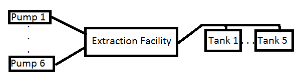
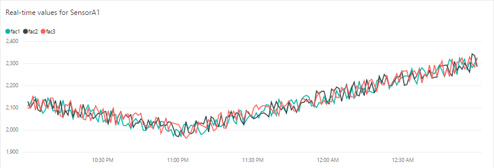
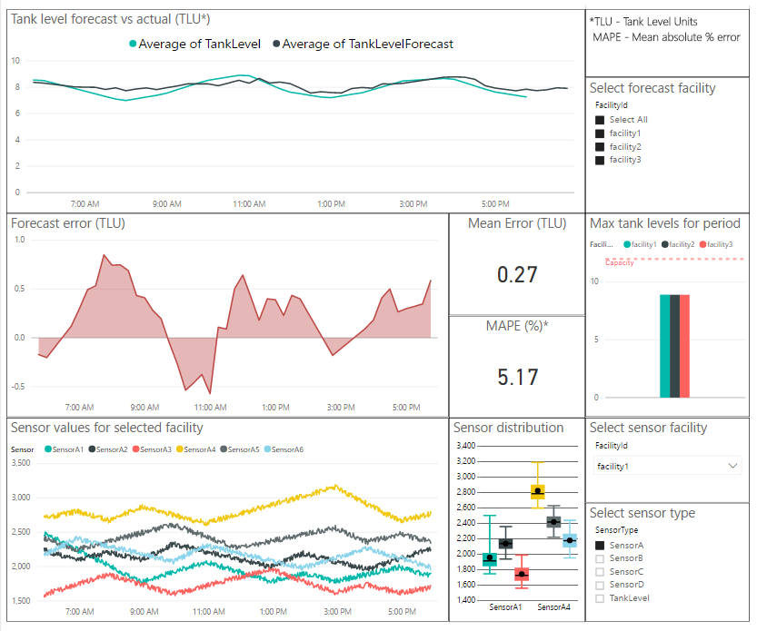

# Predictive Analytics for Tank Level Forecasting

# 1. Approach 

Tank Level Forecasting data are characterized by oil pump sensor readings and storage tank oil level readings (see [Figure 1](#Figure1)).

- The data are obtained from oil extraction facilities that are processing a mixture of oil, gas, and water pumped from the same field.
- Each facility is provided with the mixture by a number of ground pumps, and the oil it extracts is stored across a number of tanks.
- Every five hours, much of the stored oil is pulled from each facility's tanks.
- Every minute, each ground pump produces readings from four different types of sensors, and also the oil level in each tank is measured. The pump sensors do not directly measure the oil content of the extracted fluid, but instead measure proxy properties like mixture volume and pressure.

 
<a id="Figure1">*Figure 1 Oil Extraction Facility*</a>

- The machine learning (ML) target is the mean oil level in a storage tank in one hour.
- Tank level predictions are done in generic Tank Level Units (TLU). This prediction can be converted to [standard volume](http://dspace.bhos.edu.az/jspui/handle/123456789/944) by using tank geometry and oil temperature.
- A training dataset is built from five statistics computed across all the pumps for each of the four sensor types at each minute, and from the mean oil level in all the tanks at each minute for the past 61 minutes.
- The dataset is used to train an ML model that will forecast the mean oil level in the storage tanks.

Training the model using statistics computed across all the pumps, and using the mean oil level in all the tanks allows the results to be used in forecasting tank levels for facilities with different numbers of pumps and oil tanks. *Note: Properly computing the mean oil level across all tanks requires that their five hour fill-pull cycles be roughly aligned, either naturally or by hand.*

# 2. Data Sources 

The solution demo uses synthetic data created for three six-pump five-tank oil processing facilities. Each pump is outfitted with four types of sensors, and each tank is outfitted with a level sensor. The sensor and oil level measurements simulate readings obtained every minute over a 30 hour period.

# 3. Machine Learning Implementation 

The predictive analytics part of the solution is implemented using [Azure ML studio](https://studio.azureml.net/). The training experiment is shown in [Figure 2](#Figure2), and uses [boosted decision trees regression](https://msdn.microsoft.com/en-us/library/azure/dn905801.aspx). The experiment can be opened in Azure ML Studio through [this Gallery page](https://gallery.cortanaintelligence.com/Experiment/Tank-Level-Forecasting-Retraining-Exp-1).

 
<a id="Figure2">*Figure 2 Azure ML Studio Training Experiment*</a>

The corresponding predictive experiment is also [published](http://gallery.cortanaintelligence.com/Experiment/Tank-Level-Forecasting-Predictive-Exp-2) with this solution.  

When adapting this solution to other datasets, the machine learning section can be expanded as needed:  
	- More preprocessing [Azure ML Studio](https://studio.azureml.net) modules for [feature engineering](https://msdn.microsoft.com/en-us/library/azure/dn905834.aspx) and [selection](https://msdn.microsoft.com/en-us/library/azure/dn905912.aspx) can be added.  
	- Different machine learning [algorithms](https://msdn.microsoft.com/en-us/library/azure/dn905922.aspx) for regression can be added and compared.  
	- Furthermore, the better regression performance may be obtained by training it using a [Tune Model Hyperparameters](https://msdn.microsoft.com/en-us/library/azure/dn905810.aspx) module.  

See also the [related resources](#Resources) at the bottom of this page for more information on how to approach the data science and machine learning component of this solution for your own data.

# 4. Power BI Dashboards 

 
<a id="Figure3">*Figure 3. Real-time Dashboard*</a>

The output data from this solution are displayed in Power BI dashboards. The image in [Figure 3](#Figure3) shows a dashboard which displays the real-time sensor values from the three simulated storage tank facilities: fac1, fac2 and fac3. The chart is generated from the output of an Azure Stream Analytics job. The line chart shows the tank level sensor values for each facility in the last 3 hours. The dashboard will be updated automatically as new sensor values come in. Instructions for creating real-time dashboards such as this with your own data can be found in [Manual Deployment Guide/README.md](./README.md).

 
<a id="Figure4">*Figure 4. Tank Level Forecast Dashboard*</a>

In [Figure 4](#Figure4), an example dashboard displays the output of the tank level forecasting model and the tank sensor values. It is built on top of the SQL Data Warehouse that holds the historical tank level sensor values and captures the output of the Azure ML Studio predictive experiment. The line chart at the top displays the tank level forecast versus the actual tank level at each point in time. The line chart underneath shows the forecast error over time. Cards displaying the forecast error metrics Mean Error and Mean Absolute Percentage Error are also provided. To the right of the forecast error visuals, the bar chart displays the maximum tank level that occurred in the time window for the three facilities. The controls in the top right allow the user to filter the dashboard to display the forecast output for selected facilities.

Historical sensor values are displayed in the bottom half of the dashboard. A line chart shows the values of each sensor over time while the boxplot to the right shows the distribution of values for each sensor and can be used to identify sensors that have outlying values. The user can filter the sensor visuals to show the values for individual facilities and sensor types using the filters on the right. The dashboard will automatically update as new data are added to the SQL Data Warehouse.

The Power BI Desktop (.pbix) file required to replicate this dashboard is published with this solution. The real-time streaming dashboard can be recreated with your own data by following the instructions in [Manual Deployment Guide/README.md](./README.md). The instructions also describe how these two dashboards can be combined and published together in a single dashboard which can be shared with others in your organization.

# 5. Related Resources 
There are many resources available through the Cortana Intelligence Gallery, such as a template on how to approach forecasting solutions that is available [here](https://gallery.cortanaintelligence.com/Collection/Retail-Forecasting-Template-1). See other solution how-to guides [here](https://github.com/Azure/Cortana-Intelligence-Suite-Industry-Solution-How-To-Guides).
